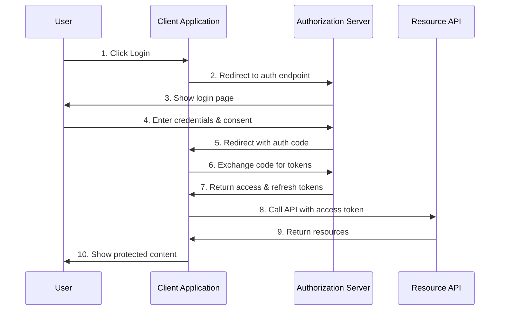
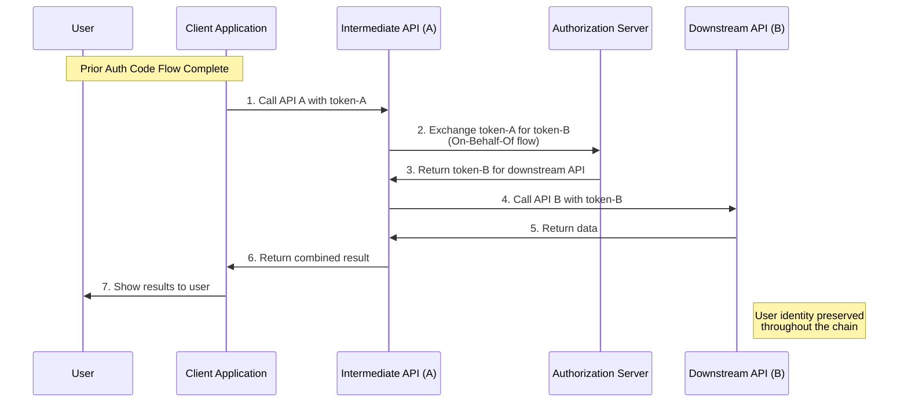
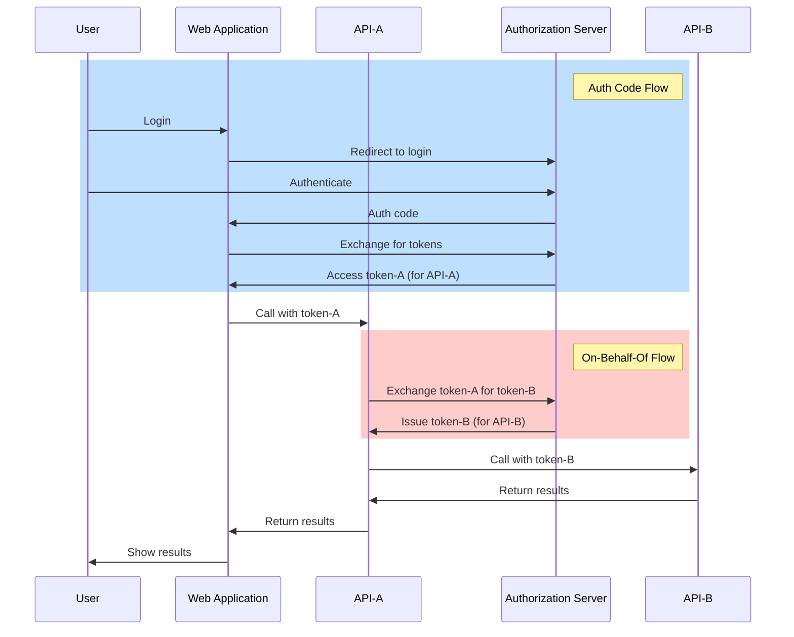

# Authorization Code Grant vs On-Behalf-Of Flow: Key Differences

## Authorization Code Grant Flow

The Authorization Code Grant flow is designed for applications that can securely store a client secret and involves direct user interaction:

### Purpose
Allows a client application to obtain an access token through user authentication and authorization.

### Flow Steps
1. User clicks "Login" in a client application
2. Client redirects user to the authorization server
3. User authenticates directly with the authorization server
4. Authorization server redirects back to client with an authorization code
5. Client exchanges this code for access and refresh tokens using its client secret
6. Client uses access token to call APIs directly

### Key Characteristics
- Requires direct user interaction (login, consent)
- The client application is the recipient of the tokens
- The client uses these tokens to make direct API calls
- Designed for applications where a user is present
- Normally requires a web browser or similar user agent

## On-Behalf-Of Flow

The On-Behalf-Of flow is designed for service-to-service scenarios where user context needs to be preserved:

### Purpose
Allows a middle-tier service to exchange a user token for another token to call a downstream API, preserving user identity.

### Flow Steps
1. User has ALREADY authenticated using some flow (like Authorization Code Flow)
2. Client application receives token-A for API-A
3. Client calls middle-tier API-A with token-A
4. API-A needs to call downstream API-B
5. API-A exchanges token-A for token-B using OBO flow
6. API-A calls API-B with token-B
7. Original user's identity is preserved throughout the chain

### Key Characteristics
- No direct user interaction during the OBO exchange
- Preserves user identity across service boundaries
- Specifically for chaining API calls through intermediary services
- The token exchange happens server-to-server
- Uses the grant_type=urn:ietf:params:oauth:grant-type:jwt-bearer

## Key Differences

1. **User Interaction**
   - Auth Code: Direct user interaction required
   - OBO: No direct user interaction (happens between services)

2. **Token Recipient**
   - Auth Code: Client application receives tokens
   - OBO: Middle-tier service receives token to call another service

3. **Starting Point**
   - Auth Code: Starts with user authentication
   - OBO: Starts with an existing access token from a previous flow

4. **Use Cases**
   - Auth Code: User-facing applications getting direct access to resources
   - OBO: API chains that need to preserve user context (microservices)

5. **Token Exchange**
   - Auth Code: Exchanges authorization code for tokens
   - OBO: Exchanges an existing access token for a new access token

## Relationship and Dependencies

These flows can work together in a larger system:

1. The Authorization Code Grant flow often provides the initial user authentication and token

2. The On-Behalf-Of flow then allows that token to be used by intermediary services

3. Example scenario:
   - User logs into a web app using Auth Code Grant
   - Web app gets token-A and calls API-A
   - API-A needs to call API-B to complete the request
   - API-A uses On-Behalf-Of flow to get token-B
   - The entire chain preserves the user's identity

In typical implementations, a web application might use the Authorization Code Grant flow for user authentication, while backend services that need to call other services while preserving user identity would use the On-Behalf-Of flow.

## References

1. [OAuth 2.0 Authorization Framework (RFC 6749)](https://tools.ietf.org/html/rfc6749) - The official OAuth 2.0 specification that defines the Authorization Code Grant flow.

2. [Microsoft identity platform and OAuth 2.0 authorization code flow](https://learn.microsoft.com/en-us/entra/identity-platform/v2-oauth2-auth-code-flow) - Microsoft's official documentation on implementing the Authorization Code flow.

3. [Microsoft identity platform and OAuth 2.0 On-Behalf-Of flow](https://learn.microsoft.com/en-us/entra/identity-platform/v2-oauth2-on-behalf-of-flow) - Microsoft's documentation on the On-Behalf-Of flow implementation.

4. [OAuth 2.0 Proof Key for Code Exchange (PKCE) - RFC 7636](https://tools.ietf.org/html/rfc7636) - Extension to the Authorization Code flow that improves security for public clients.

5. [OAuth 2.0 Security Best Current Practice](https://datatracker.ietf.org/doc/html/draft-ietf-oauth-security-topics) - IETF document covering security considerations for OAuth 2.0 implementations.

6. [The Modern Guide to OAuth](https://fusionauth.io/learn/expert-advice/oauth/modern-guide-to-oauth) - A comprehensive guide to understanding OAuth 2.0 concepts and flows.

7. [Understanding OAuth 2.0 and OpenID Connect](https://www.oauth.com/) - Aaron Parecki's authoritative guide to OAuth 2.0 and OpenID Connect.

8. [JWT Handbook](https://auth0.com/resources/ebooks/jwt-handbook) - Understanding the components of JSON Web Tokens used in these flows.

9. [OAuth 2.0 for Browser-Based Apps](https://datatracker.ietf.org/doc/html/draft-ietf-oauth-browser-based-apps) - Best practices for implementing OAuth in browser-based applications.

10. [Microsoft Authentication Library (MSAL) Documentation](https://learn.microsoft.com/en-us/azure/active-directory/develop/msal-overview) - Microsoft's library for implementing OAuth 2.0 flows including both Authorization Code and On-Behalf-Of flows.
