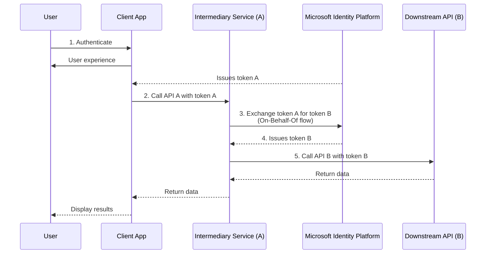
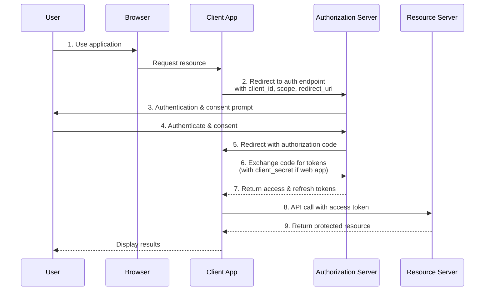

# Comparing OAuth 2.0 On-Behalf-Of Flow vs. Authorization Code Flow

After analyzing both Microsoft documentation pages, here are the key differences between these two OAuth 2.0 flows:

## OAuth 2.0 On-Behalf-Of (OBO) Flow - Simplified Explanation

Think of the On-Behalf-Of flow like a chain of trust that passes from service to service. Here's a real-world analogy:

Imagine you (the user) give your house key (access token) to a trusted plumber (intermediary service) to fix your sink. The plumber realizes he needs special parts and calls another specialist (downstream service). Instead of asking you to come home and let the specialist in, the plumber can say "I'm working on behalf of the homeowner" and temporarily transfer the authority you gave him to the specialist.

In technical terms:
1. You sign in to an application and it gets an access token
2. That application calls an intermediary service using your token
3. The intermediary service needs to call another API (downstream)
4. Instead of making you sign in again, the intermediary service exchanges your original token for a new one
5. This new token allows the intermediary service to access the downstream API "on behalf of" you
6. Your identity and permissions are preserved throughout the entire chain

The key benefit is that services can work together using your identity without requiring you to sign in multiple times.

## OAuth 2.0 On-Behalf-Of (OBO) Flow - Technical Details

### Purpose and Use Case
- **Service-to-service communication**: Used when an intermediary service (web API) needs to call another downstream service while preserving the user's identity
- **Delegation flow**: Passes user's identity and permissions through the request chain
- **No direct user interaction**: Operates without requiring the user to be present

### Flow Characteristics
- Begins with an existing access token that the intermediary service received from a client
- The intermediary service exchanges this token for a new token targeted at a downstream API
- Uses `grant_type=urn:ietf:params:oauth:grant-type:jwt-bearer`
- Always requires `requested_token_use=on_behalf_of`

### Key Limitations
- Cannot be used with app-only tokens (only works with user principals)
- Applications with custom signing keys can't be used as intermediary service APIs
- Consent for the downstream API must be provided upfront (during initial authentication)

## OAuth 2.0 Authorization Code Flow

### Purpose and Use Case
- **Direct client-to-resource access**: Used when a client application (web, mobile, SPA) needs direct access to resources
- **User-centric**: Designed for scenarios where the user is directly interacting with the client application
- **Requires user-agent**: Needs a browser or similar component that supports redirection

### Flow Characteristics
- Begins with user authentication at the authorization endpoint
- Returns an authorization code to the client application via redirect URI
- Client exchanges this code for access tokens using a separate token request
- Uses `grant_type=authorization_code`

### Application Types
- Works for single-page applications (SPAs)
- Standard web applications
- Desktop and mobile applications

## Major Differences

1. **Interaction Model**:
   - **Auth Code**: Direct user involvement in authentication
   - **OBO**: No direct user involvement, happens between services

2. **Token Exchange**:
   - **Auth Code**: Exchanges an authorization code for tokens
   - **OBO**: Exchanges an existing access token for another access token

3. **Consent Handling**:
   - **Auth Code**: User provides consent during the flow
   - **OBO**: Consent must be provided beforehand or through combined consent mechanisms

4. **Starting Point**:
   - **Auth Code**: Starts with user authentication
   - **OBO**: Starts with an existing access token

5. **Use Cases**:
   - **Auth Code**: Used by client applications directly accessed by users
   - **OBO**: Used by intermediary services to propagate identity to downstream services

6. **Grant Type**:
   - **Auth Code**: Uses `authorization_code`
   - **OBO**: Uses `urn:ietf:params:oauth:grant-type:jwt-bearer`
