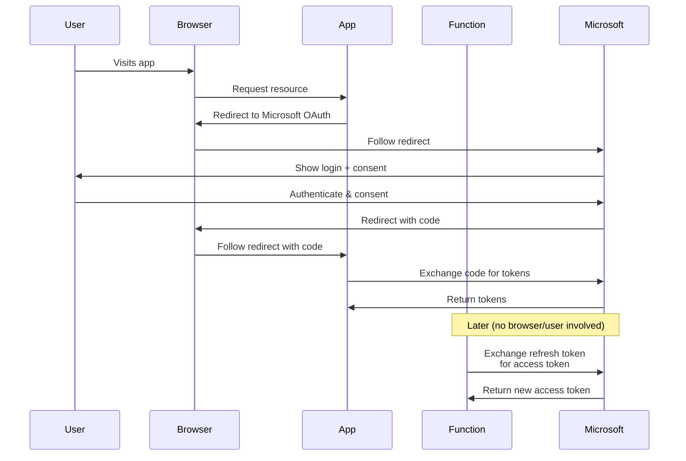

## Technical Reasons for the Difference

- **Django App**: Handles the **authorization code request** (requires redirection)
- **Cloud Function**: Handles **only the refresh token exchange** (no redirection needed)

### 2. Browser Context Requirements

- **Authorization Code Request**: Requires a browser context because:
  - The user must authenticate directly with Microsoft
  - The user must view and grant consent
  - Microsoft needs to redirect back to your application
  
- **Refresh Token Exchange**: No browser context needed because:
  - No user authentication is required
  - No consent screen is required
  - It's a direct server-to-server API call

## Visualization of the Two Different Flows



## Code Comparison

### Django App: Requires Redirection

```python
@csrf_exempt
def bingads_oauth(request, ac_seq):
    # Create authentication object
    authentication = create_web_authentication()
    authentication.state = encoded_state
    
    # Get authorization URL
    auth_url = authentication.get_authorization_endpoint()
    
    # REDIRECTION happens here - sends user's browser to Microsoft
    return redirect(auth_url)
```

This code **must redirect the user's browser** because:
1. Only the user can authenticate with their credentials
2. Only the user can grant consent
3. The OAuth protocol requires this redirection for security

### Cloud Function: No Redirection

```python
def get_authorization_data(oauth_config: Dict[str, Any]) -> AuthorizationData:
    # ... setup code ...
    
    refresh_token = oauth_config.get('oauthToken', {}).get('refresh_token')
    if refresh_token:
        # Direct API call - no redirection needed
        auth.authentication.request_oauth_tokens_by_refresh_token(refresh_token)
    
    return auth
```

This code **doesn't redirect** because:
1. It already has a refresh token from a previous authentication
2. The refresh token exchange is a direct API call to Microsoft
3. No user interaction is required at this stage


## Architectural Best Practice

Your current setup actually follows best practices for OAuth implementation:

1. Use a **web application** (Django) to handle the initial authentication flow with redirections
2. Store the resulting refresh token securely
3. Use **serverless functions** to handle background API calls using the refresh token

This separation creates a more secure and scalable architecture:

- The user-facing component handles user interaction
- The background component handles API operations
- Each component is optimized for its specific role

## Conclusion

The redirection doesn't happen in your Cloud Function because:

1. It's handling the refresh token flow, which doesn't require redirection
2. Cloud Functions aren't designed to handle browser redirections effectively
3. You've already completed the redirection-based authorization in your Django app

This is not a limitation but actually the correct implementation of OAuth for different environments. Your architecture correctly separates the user-interactive authentication flow (Django app with redirections) from the background token management (Cloud Function without redirections).
